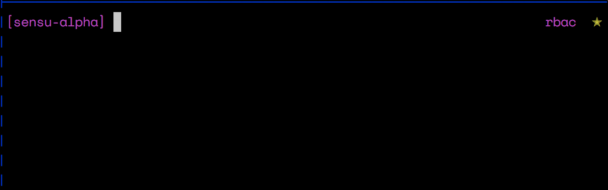
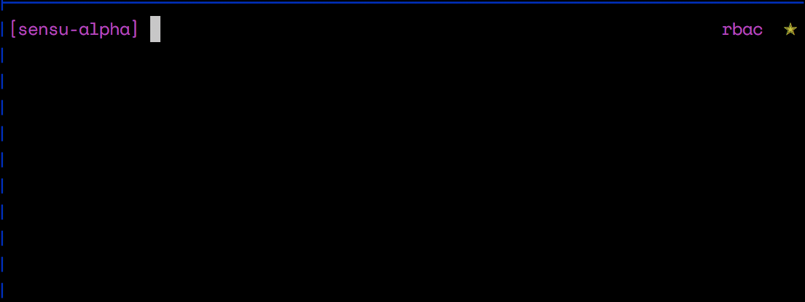
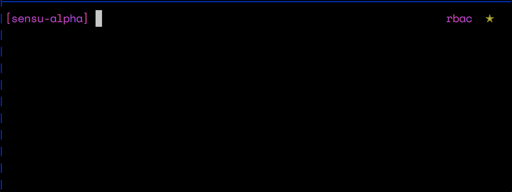

# Users and Roles

## Users

In Sensu users are a resource that represents a person or thing that has access
to your system.

### View Users

To view all the users, that your account has access to see.

> sensuctl user list
```sh
   Username      Roles   Enabled
─────────────── ─────── ─────────
 admin           admin   true
 deanlearner     admin   true
 garthmarenghi   admin   true
 lizasher        admin   false
```

### Managing Users

You can easily add users through the CLI tool.



Alternatively the CLI tool has a non interactive option as well.

```sh
sensuctl user create garthmarenghi --password darkplace123
sensuctl user create deanleaner --admin --password passw0rd # easily make them an admin
sensuctl user create juliensanchez --roles viewer,agent --password passw0rd # apply roles
```

If you need to disable a user, you can simply use the `disable` subcommand.

```sh
sensuctl user disable lizasher
```

However, later if you would like to reinstate their account.

```sh
sensuctl user reinstate lizasher
```

## Roles

The initial installation of Sensu includes an initial `admin` role that gives an
user associated with it full access to the system.

Further, you can easily create more roles that give as much (or as little) access
as you see fit.

As a reminder, a role contains a set of rules. Each rule contains a permission
that applies to a resource type.

### Resource Permissions

The following permissions are available to use in rules:

| Permission | Description |
|---|---|
| `create` | The **create** permission allows creation of specified resource |
| `read` | The **read** permission allows to see specified resource |
| `update` | The **update** permission allows update of specified resource |
| `delete` | The **delete** permission allows deletion of specified resource |

### Resource Types

| Type | Description |
|---|---|
| `*` | Manage all resources. **NOTE**: The `*` type gives precedence to its rule over other rules within the same rule. If you wish to deny a certain type, you can't use the `*` type and must explicitly allow every type required |
| `assets` | Manage asset resources within a given organization & environment |
| `checks` | Manage check resources within a given organization & environment |
| `entities` | Manage entity resources within a given organization & environment |
| `environment` | Create and remove environments |
| `events` | Manage event resources within a given organization & environment |
| `handlers` | Manage handler resources within a given organization & environment |
| `mutators` | Manage mutator resources within a given organization & environment |
| `organizations` | Create and remove organizations |
| `roles` | Create, remove roles and set rules within |
| `users` | Manage user resources |

### Viewing Roles

To view all the roles currently configured in your Sensu installation. Run the
following:

```sh
sensuctl role list
```

To view all the rules configured for a role.

```sh
sensuctl role list-rules MY-ROLE
```

#### Example



### Managing Roles

To add a new role, simply call the `sensuctl` role create command with it's
intended name.

```sh
sensuctl role create dreamweaver
```

To add rules to the role, use the `add-rule` subcommand.

```sh
sensuctl role add-rule dreamweaver --type events --read
sensuctl role add-rule dreamweaver -t checks -crud      # short hand
```

To remove a rule from the role, pass the role and rule type to the `remove-rule`
subcommand.

```sh
sensuctl role remove-rule dreamweaver checks
```

Finally, to remove a role from the system run the `delete` subcommand.

```sh
sensuctl role delete dreamweaver
```

#### Example




### Managing User Roles

If you would like to add a role to an existing user, the `add-role` user
subcommand can do just that.

```sh
sensuctl user add-role garthmarenghi admin
```

Easy cometh, easy goeth. Removing a role is just as easy.

```sh
sensuctl user remove-role garthmarenghi admin
```
