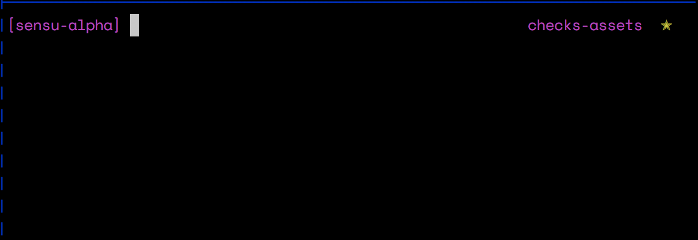

# Checks and Assets

## Checks

## Assets

Assets are a way to provide your checks with runtime dependencies they require
to execute. These can be anything from scripts (e.g. check-haproxy.sh) to
full runtimes (ruby, python, etc.) Most helpful in environments without a
configuration management system, where your systems, images, containers, might
not have everything required to run a execute a check.

At runtime the agent sequentially fetches assets and stores them in it's local
cache. On subsequent check executions it checks for the presence of the asset in
it's cache and ensures that the contents matches it's checksum.

### Asset Structure

The agent expects that an asset is a TAR archive that may optionally be GZip'd.
Any scripts or executables should be within a `bin/` folder within in the
archive.

Further when the check is executed, the following are injected into the
execution context.

- `{PATH_TO_ASSET}/bin` is injected into the `PATH` environment variable.
- `{PATH_TO_ASSET}/lib` is injected into the `LD_LIBRARY_PATH` environment variable.
- `{PATH_TO_ASSET}/include` is injected into the `CPATH` environment variable.

### Storage

At this time the Sensu's backend does not provide any storage capabilities for
assets. The assets are expected to be retrieved over HTTP or HTTPS.

### Basics

To view all assets currently available in your configured Sensu instance. Run:

```sh
sensuctl asset list
```

If you want more in depth details on an asset, you can use the `info`
subcommand.

```sh
sensu asset info my-great-check-sh
```

Assets can be created both interactively..



or by using CLI flags.

```sh
sensuctl asset create curl --url "https://acme.s3.amazonaws.com/curl-7.52.1.tar" --sha512 d940d3975051f7cb70c28bbf4b45cf4805b5113d44c96ed120e4a8a6206e55ed3fcdabb37158e3989d24267d9e185896e872ab7b10571edc90b62c0a20512346
```

### Filters

Filters are used to specify conditions in-which your asset should be installed
on an agent. For example you have a check that's assets have to differ for each
platform.

eg.

- You create an asset name `curl/linux`; the filter associated with this
  asset are System.OS=='linux'
- Next, you create an asset for freebsd named `curl/freebsd`; the filter would
  look like `System.OS=='freebsd'`
- Finally to associate the assets with a check, you can refer the group by it's
  prefix. Eg. a check named `check-website` with assets `['curl'].`

### Sensu Query Language

**TODO**

### Managing Asset Filters

Creating a new asset with filters is as simple as:

```sh
sensuctl asset create curl/linux64 --url "http://acme.s3.amazonaws.com/curl-7-linux.tar" --sha512 XXX --filter "System.OS=='linux'" --filter "System.Arch == 'amd64'"
```
**NOTE:** At the moment there is no way to edit the filters associated with an
existing asset. However, you can re-create the asset with the same name and the
existing entity will be overwritten.

To create a new check associated with an asset, run:

```sh
sensuctl create check check-my-website --command "curl http://something" --runtime-asset ruby24,python31
```

Example using the assets prefix:

```sh
sensuctl asset create curl/linux --url "http://acme.s3.amazonaws.com/curl-7-linux.tar" --sha512 XXX --filter "System.OS=='linux'" --filter "System.Arch == 'amd64'"
sensuctl asset create curl/macos --url "http://acme.s3.amazonaws.com/curl-7-macos.tar" --sha512 XXX --filter "System.OS=='macos'" --filter "System.Arch == 'amd64'"
sensuctl create check check-my-website --command "curl http://something" --runtime-asset curl # by using prefix captures both assets
```
